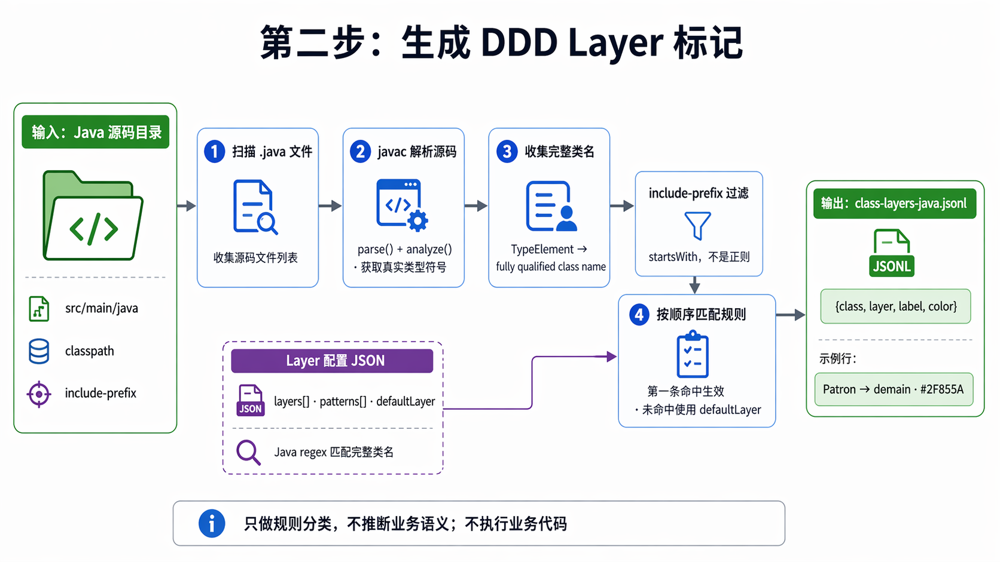

# DDD Layer Config Reference

Visual DDD Skill assigns DDD layer metadata by matching fully qualified Java class
names against ordered regex rules.

## Diagram

Image file: `assets/ddd-layer-flow.png`



## Where To Configure

Layer rules live in a JSON file with any filename. Pass that file as the third
argument to `generate_class_layers_jsonl.sh`; the script does not infer project
layers and does not apply a bundled config automatically.

```bash
<skill-dir>/scripts/generate_class_layers_jsonl.sh \
  /path/to/project/src/main/java \
  /path/to/project/.tmp/class-layers-java.jsonl \
  /path/to/my-ddd-layers.json \
  "$CLASSPATH" \
  io.pillopl.library
```

Start from `references/example-ddd-layers.json` if helpful, then customize a
project-specific config from the package structure and architecture docs before
generating layer metadata.

## Schema

```json
{
  "layers": [
    {
      "id": "domain",
      "label": "Domain",
      "color": "#2F855A",
      "patterns": [".*\\.model(\\..*)?\\.[^.]+$"]
    }
  ],
  "defaultLayer": {
    "id": "unknown",
    "label": "Unknown",
    "color": "#A0AEC0"
  }
}
```

- `layers`: Ordered layer rules; the first match wins.
- `id`: Stable machine-readable layer id.
- `label`: Human-readable layer name.
- `color`: Hex color for later visualization.
- `patterns`: Java regex patterns matched against the full class name.
- `defaultLayer`: Fallback metadata when no rule matches.

## Pattern Syntax

`patterns` use Java regular expressions (`java.util.regex.Pattern`), not SQL
`LIKE` and not shell glob syntax.

- Use `.*` for any number of characters.
- Use `\\.` in JSON to match a literal dot in a package name.
- `%` has no wildcard meaning.
- A bare `*` is not a valid "match anything" pattern.
- Matching uses `matches()`, so the regex must match the whole class name.

Example:

```json
".*\\.model(\\..*)?\\.[^.]+$"
```

This matches classes such as:

```text
io.pillopl.library.lending.patron.model.Patron
io.pillopl.library.lending.book.model.Book.BookId
```

## Example Layers

The bundled `references/example-ddd-layers.json` is a reference template, not a
project truth. Copy it or create a new JSON file, rename it freely, and pass that
file path in the command.

Use separate rules when you want `model` and `domain` rendered differently:

```json
{
  "layers": [
    {
      "id": "model",
      "label": "Model",
      "color": "#2F855A",
      "patterns": ["^io\\.pillopl\\.library\\..*\\.model(\\..*)?\\.[^.]+$"]
    },
    {
      "id": "domain",
      "label": "Domain",
      "color": "#276749",
      "patterns": ["^io\\.pillopl\\.library\\..*\\.domain(\\..*)?\\.[^.]+$"]
    },
    {
      "id": "application",
      "label": "Application",
      "color": "#2B6CB0",
      "patterns": ["^io\\.pillopl\\.library\\..*\\.application(\\..*)?\\.[^.]+$"]
    }
  ],
  "defaultLayer": {
    "id": "unknown",
    "label": "Unknown",
    "color": "#A0AEC0"
  }
}
```

If `model` and `domain` should both be rendered as one Domain layer, put both
patterns in one layer's `patterns` array.

## Output JSONL

Each line is one class metadata record:

```jsonl
{"class":"io.pillopl.library.lending.patron.model.Patron","layer":"domain","label":"Domain","color":"#2F855A"}
```

`include-prefix` only filters which classes are emitted; it is a plain
`startsWith` prefix check, not a regex.
