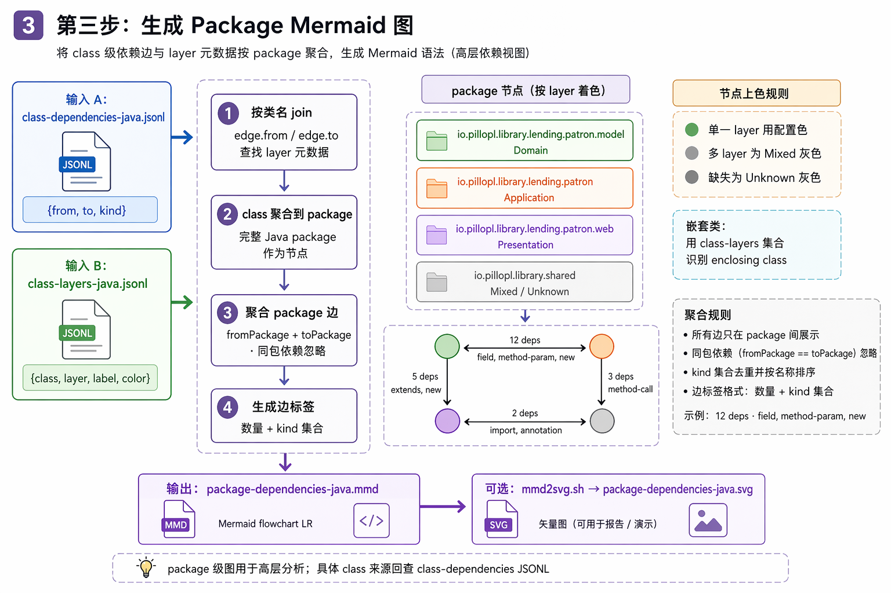

# Package Dependency Visualization Reference

This reference documents the third Visual DDD Skill step: joining class dependency
JSONL with class layer JSONL and rendering a package-level Mermaid graph.

## Diagram

Image file: `assets/package-mermaid-flow.png`



## Inputs

```text
.tmp/class-dependencies-java.jsonl
.tmp/class-layers-java.jsonl
```

Class dependencies provide detailed class-level edges:

```jsonl
{"from":"pkg.a.A","to":"pkg.b.B","kind":"method-param"}
```

Class layers provide color metadata:

```jsonl
{"class":"pkg.a.A","layer":"application","label":"Application","color":"#2B6CB0"}
```

## Package Aggregation

- Each full Java package becomes one Mermaid node.
- Class-level edges are grouped by `fromPackage + toPackage`.
- Dependencies inside the same package are ignored in the package graph.
- Edge labels show the grouped dependency count and sorted `kind` set, for example:

```text
12 deps · field, method-param, new
```

Use `class-dependencies-java.jsonl` when you need to trace a package edge back
to the exact source classes.

## Layer Coloring

- If every class in a package has the same layer, the package uses that layer's color.
- If a package contains classes from multiple layers, it is marked `Mixed` and rendered gray.
- If no layer metadata exists for a package edge endpoint, it is marked `Unknown` and rendered gray.

## Nested Classes

Nested classes are mapped back to their real Java package by checking the class
names present in `class-layers-java.jsonl`. This avoids treating
`pkg.Outer.Inner` as package `pkg.Outer`.

If the enclosing class cannot be identified, the converter falls back to the
last `.` in the class name.

## Outputs

```text
.tmp/package-dependencies-java.mmd
.tmp/package-dependencies-java.svg
```

Mermaid is the primary output. SVG is generated separately with Mermaid CLI via
`scripts/mmd2svg.sh`.
