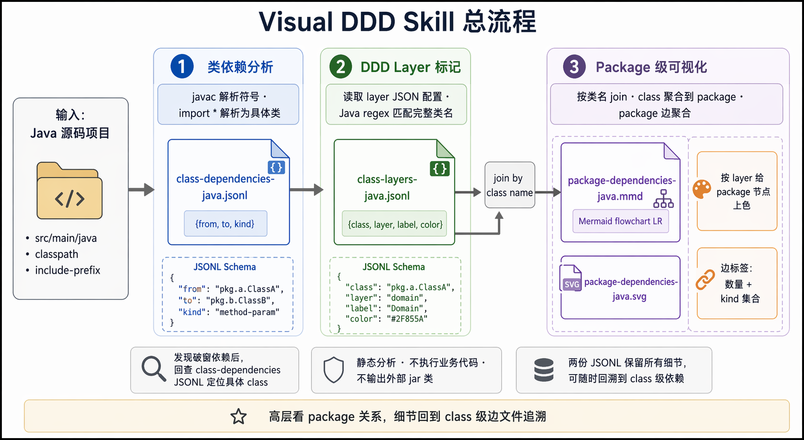

# Visual DDD Workflow Reference

This reference keeps the high-level workflow and diagram index for Visual DDD
Skill.

## Overview Diagram

Image file: `assets/visual-ddd-overall-flow.png`



## Diagram Index

| Step | Image file | Reference |
|---|---|---|
| 1. Class dependency edges | `assets/class-dependency-flow.png` | `references/class-dependency-jsonl.md` |
| 2. DDD layer metadata | `assets/ddd-layer-flow.png` | `references/ddd-layer-config.md` |
| 3. Package Mermaid graph | `assets/package-mermaid-flow.png` | `references/package-dependency-visualization.md` |
| Overall workflow | `assets/visual-ddd-overall-flow.png` | `references/visual-ddd-workflow.md` |

## Artifacts

```text
class-dependencies-java.jsonl  -> class-level dependency edges
class-layers-java.jsonl        -> class-level DDD layer metadata
package-dependencies-java.mmd  -> package-level Mermaid graph
package-dependencies-java.svg  -> optional SVG rendered from Mermaid
```

The package-level graph is for high-level dependency review. When a suspicious
package dependency appears, trace it back through `class-dependencies-java.jsonl`
to find the exact source classes.
